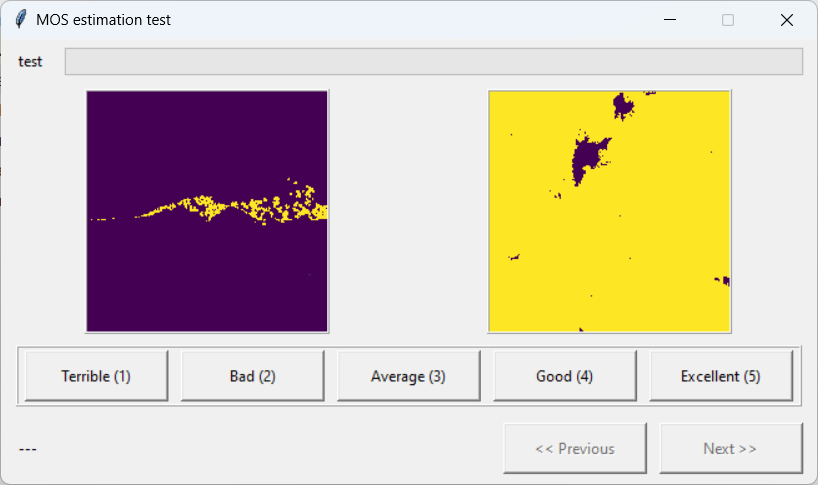
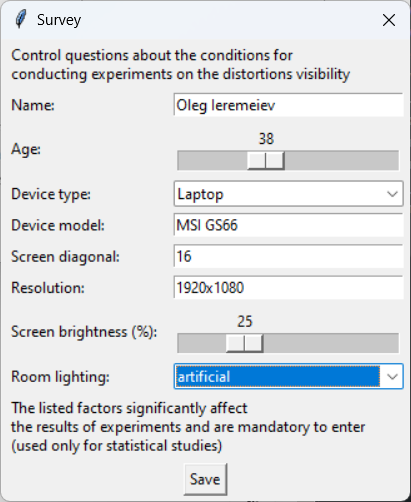
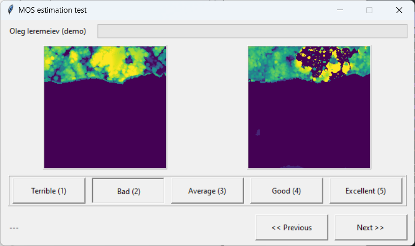

# MOS estimation test

The program is designed to obtain a quantitative assessment of the visual quality between the original and reconstructed images

**Task**: for a selected set of image pairs (ground truth and reconstructed), assess the visual degree of difference 
from 1 (terrible) for colossal differences in a pair of images to 5 (excellent) for images with unnoticeable or just noticeable differences



### Installation

The program requires a minimum number of dependencies for the graphical interface, listed in the file "requirements.txt"

Command to install dependencies is
```shell
pip install -r requirements.txt
```
or with powershell (Windows 10-11)
```shell
py -m pip install -r requirements.txt
```

**Note**: In Windows, the Tkinter library is already installed together with the Python interpreter. For Linux and MacOS, 
you may need to additionally install TK library like (Ubuntu):

```shell
sudo apt install python3-tk
```

### Start
To run the program you need to execute the file "experiment.pyw" (windowed python app without console)

PowerShell alternative:
```shell
py .\experiment.pyw
```

### Experiment structure

1. **Stage 1**. To take into account the specific conditions of the experiment (resolution and display settings, 
lighting features), a short survey is initially conducted. It is impossible to provide identical laboratory conditions, 
so the survey results are important for identifying possible reasons for differences in individual results.



2. **Stage 2 (demo mode)**. To get acquainted with the program interface, the demo mode is launched, which shows 5 pairs of images 
and possible visual quality assessments for them.



3. The main experiment consists of 198 image pairs (version 2.0 update) stored in the “images” folder, that need to be estimated. It is 
recommended to use no more than 5 seconds for each image pair. \
**Note**: hovering over an image allows you to zoom in on that fragment up to 200%
4. The evaluation results and additional technical information are stored in the “results” folder. The results are also automatically uploaded to the cloud for centralized collection of information. They can also be downloaded directly from the link https://e.pcloud.com/#page=puplink&code=apQ7ZTjKmwtFEpCQTr3Gv6DYlymuEtUey

